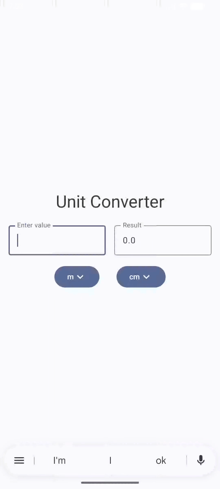

# UnitConverter (Android)

   
  <em>Live unit conversion using Jetpack Compose</em>

A simple **Jetpack Compose** unit conversion app (length units).
It converts between **cm, m, ft, mm** and updates the result instantly as you type or change units.

## Features

- Jetpack Compose UI (Material 3)
- Two input fields: value + read-only result
- Two dropdowns for selecting input and output units
- Live conversion (no “Convert” button needed)
- Rounded to 2 decimal places

## Units Supported (Length)

- `mm` (millimeter)
- `cm` (centimeter)
- `m` (meter)
- `ft` (foot)

## How It Works

The app uses **meters (m)** as the default unit.

Conversion formula:

- `inputInMeters = inputValue * inputFactor`
- `outputValue = inputInMeters / outputFactor`

Example:

- If input is `10 ft` and output is `m`
- `10 * 0.3048 / 1.0 = 3.048 m`

Rounding:

- Result is rounded to **2 decimals** using:
  - `(raw * 100).roundToInt() / 100.0`

## Tech Stack

- Kotlin
- Jetpack Compose
- Material 3

## Getting Started

1. Clone or download this project
2. Open in **Android Studio**
3. Sync Gradle
4. Run on an emulator or physical device

## Project Structure

- `MainActivity.kt` - Hosts Compose content and displays `UnitConverter()`
- `UnitConverter()` - Main composable (UI + conversion logic)
